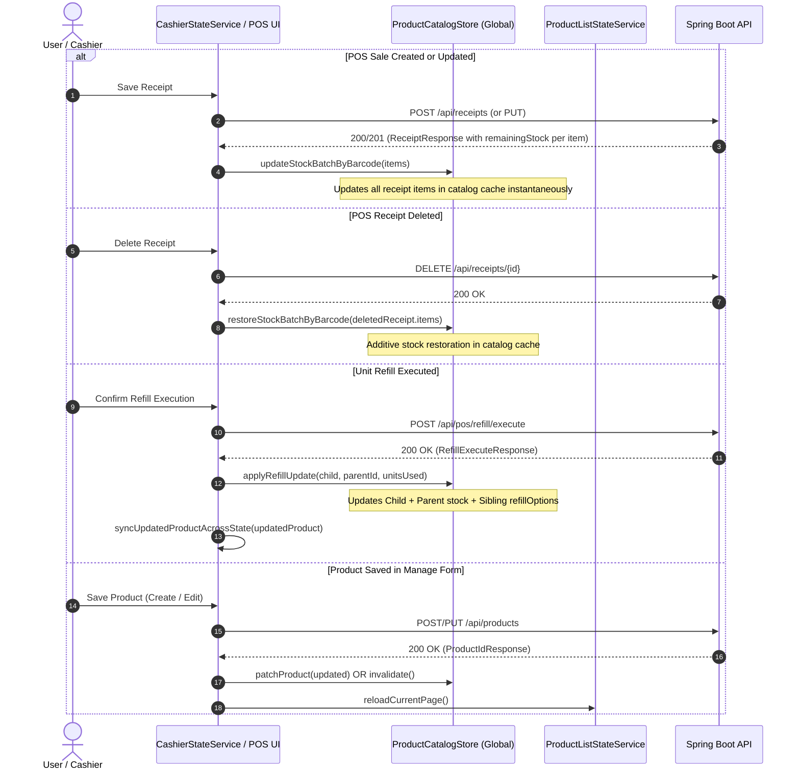
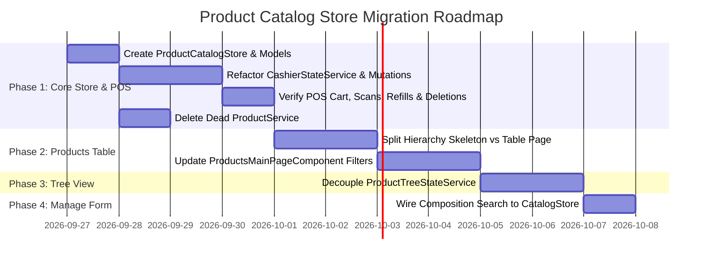

# Product Catalog Service — Frontend Architecture Evaluation & Implementation Plan

> **Document Scope:** Architectural evaluation, data flow integrity analysis, domain boundary definition, technical specifications, and step-by-step implementation plan for introducing a shared frontend Product Catalog Store across the POS and inventory ecosystem (bounded scale: ~3,000 products).
> **Updated:** Incorporating findings from Critical Architecture Review (data model unification, batch stock mutations, multi-product refill cascades, and cascading filter dropdown preservation).

---

## 1. Executive Summary & Architectural Verdict

### The Current State & Problem
The application contains ~3,000 products. Multiple frontend features require product data:
* **Cashier / POS (`/pos/cashier`):** High-frequency barcode scanning, name search, stock validation, cart item synchronization, and atomic unit refills.
* **Product Management Table (`/pos/products`):** Multi-facet filtering (cascading categories ➔ brands ➔ groups), searching, sorting, and paginated display.
* **Product Tree View (`/pos/products/tree`):** Hierarchical Category ➔ Brand ➔ Group ➔ Product tree with drag-and-drop structural mutations.
* **Product Create / Edit (`/pos/product/manage`):** Deep entity aggregate editing (barcodes, attributes, conversion rules, BOM materials / composition search).

Currently, data fetching is fragmented and causes performance bottlenecks:
1. `/pos/products` loads the entire 3-tier hierarchy (`GET /api/products/tree?includeProducts=true`, ~2.2 MB JSON) and traverses/flattens all 3,000 items in JavaScript on the client thread just to display 100 rows and populate dropdown filters.
2. `/pos/cashier` loads all active products via `GET /api/products/all-products` into a private component signal and performs $O(N)$ linear scans on every keystroke.
3. `/pos/products/tree` directly queries `/api/products/tree`, bypassing state services.
4. `/pos/product/manage` triggers a separate `GET /api/products?size=1000` call when searching composition/conversion materials.
5. Legacy service `src/app/features/pos/core/services/product.service.ts` contains dead code with zero live consumers.

---

### The Architectural Verdict: **Hybrid Segregated Store Architecture**

A **single monolithic "God Store"** that attempts to hold the tree structure, paginated table state, deep edit aggregates, and POS lookup cache in one shared object graph is an **anti-pattern**. It causes severe memory churn, cascading re-renders, and brittle cache invalidation.

Instead, we implement a **Hybrid Two-Tier Store Architecture** tailored for ~3,000 products:

```
                                      BACKEND (Spring Boot)
                                                │
         ┌────────────────────────┬─────────────┴─────────────┬────────────────────────┐
         │                        │                           │                        │
   GET /api/products/       GET /api/products/tree       GET /api/products        GET /api/products/{id}
     all-products           ?includeProducts=false       (Pageable, Query,        (Deep Edit Aggregate)
   (Lightweight DTO)        (Hierarchy Skeleton)          Specification)               │
         │                        │                           │                        │
═════════╪════════════════════════╪═══════════════════════════╪════════════════════════╪═════════════════
         │                        │                           │                        │
         ▼                        │                           │                        ▼
┌────────────────────────────┐    │                           │               ┌───────────────────┐
│ ProductCatalogStore        │    │                           │               │ ProductManage     │
│ (Global Singleton Service) │    │                           │               │ StateService      │
│  ├── catalogProducts()     │    │                           │               │ (Scoped to Form)  │
│  ├── barcodeIndex (Map)    │    │                           │               └───────────────────┘
│  ├── idIndex (Map)         │    │                           │
│  ├── searchCatalog()       │    │                           │
│  ├── updateStockBatch()    │    │                           │
│  ├── restoreStockBatch()   │    │                           │
│  └── applyRefillUpdate()   │    │                           │
└──────────────┬─────────────┘    │                           │
               │                  │                           │
        ┌──────┴──────┐           ▼                           ▼
        │             │    ┌───────────────┐          ┌───────────────┐
        ▼             ▼    │ ProductList   │          │ ProductTree   │
┌─────────────┐ ┌────────┐ │ StateService  │          │ StateService  │
│ Cashier/POS │ │ Search │ │ (Skeleton     │          │ (Hierarchy    │
│ Page/Cart   │ │ Popup  │ │  Filters +    │          │  Tree / DAG)  │
└─────────────┘ └────────┘ │  Paginated)   │          └───────────────┘
                           └───────────────┘
```

1. **`ProductCatalogStore` (Global Singleton In-Memory Store):**
   * Holds the complete catalog of ~3,000 products in memory with zero-latency $O(1)$ Hash Map indexes (`Map<Barcode, Product>` and `Map<Id, Product>`).
   * Fully compatible with the POS `Product` contract (`costPrice`, `isActive`, `refillOptions`, etc.).
   * Handles optimistic multi-product stock mutations (sales batch updates, delete batch restores, atomic refills).
   * Feeds **Cashier / POS**, **Quick Search Popups**, and **Manage Product Composition Search**.
2. **Feature-Scoped States (Decoupled & Specialized):**
   * **`ProductListStateService` (`/pos/products`):** Consumes lightweight hierarchy skeleton (`GET /api/products/tree?includeProducts=false`) for cascading category/brand/group filter dropdowns, while table rows are populated via server-side pagination (`GET /api/products?page=0&size=100`).
   * **`ProductTreeStateService` (`/pos/products/tree`):** Consumes the hierarchical tree DAG for visual tree management and drag-and-drop structural mutations.
   * **`ProductManageStateService` (`/pos/product/manage`):** Consumes deep product aggregates (`GET /api/products/{id}`) for form editing.

---

## 2. In-Memory Feasibility & Scale Analysis (~3,000 Products)

Since the catalog scale is bounded at **~3,000 products**, an in-memory Angular Signal store with Map indexes is the optimal, production-grade approach:

| Metric | Bounded Catalog (~3,000 Items) | Evaluation / Impact |
|---|---|---|
| **Raw JSON Payload** | ~250 KB | Single fast HTTP download |
| **Gzipped Transfer Size** | ~50 KB | Transferred in < 35 ms over local network |
| **Browser Heap Allocation** | ~400 KB | Virtually negligible memory footprint in V8 heap |
| **Barcode Scan Lookup ($O(1)$ Hash Map)** | **< 0.01 ms** | **Instantaneous scanner response** (0ms lag) |
| **Client-Side Name/Barcode Filter** | **~1 – 3 ms** | Ultra-responsive search popup |
| **No Extra Dependencies Needed** | Pure Angular Signals | No IndexedDB/WebWorker complexity required |

---

## 3. Store Ownership & Domain Boundary Matrix

| Store / Service | Scope | Data Owned | Backend Endpoint | Primary Consumers |
|---|---|---|---|---|
| **`ProductCatalogStore`** *(NEW)* | Global Root Singleton (`providedIn: 'root'`) | Full catalog (`Product[]`), $O(1)$ `barcodeIndex`, $O(1)$ `idIndex`, Cache TTL, Batch Stock Mutations | `GET /api/products/all-products` | Cashier POS, Barcode Scanner, Search Popup, Manage Product Material Search |
| **`ProductListStateService`** | Feature / Page | Hierarchy skeleton (categories, brands, groups) for cascading filters + Paginated `ProductListItemDto` rows (100 items) | `GET /api/products/tree?includeProducts=false` (Filters) + `GET /api/products` (Table Page) | `/pos/products` (Main Management Table) |
| **`ProductTreeStateService`** | Feature / Page | Hierarchical `CategoryTreeNodeDto` DAG, node expansion states, tree statistics, drag-drop mutations | `GET /api/products/tree?includeProducts=true` | `/pos/products/tree` (Product Tree View) |
| **`ProductManageStateService`** | Feature / Form | `ProductManageDetailDto` (deep aggregate with conversions, BOM materials, barcodes), validation | `GET /api/products/{id}` + Lookups | `/pos/product/manage` & `/pos/product/manage/:id` |

---

## 4. Technical Specifications for `ProductCatalogStore`

### 1. Data Model & Type Contract Unification

To prevent runtime errors, cart breakdown, or search filtering bugs, the catalog data model is unified with the core POS `Product` contract from [`pos.models.ts`](file:///d:/Software/AL-Baraka/Pos/Cashier-web/Cashier-web-front/src/app/features/pos/core/models/pos.models.ts):

```typescript
// src/app/core/products/models/catalog-product.model.ts
import { RefillOption } from '../../../features/pos/core/models/pos.models';

export interface CatalogProduct {
  id: number;
  name: string;
  barcode: string;
  costPrice: number;
  sellingPrice: number;
  buyingPrice: number;
  stockQuantity: number;
  stock?: number;
  refillOptions?: RefillOption[];
  isActive: boolean;
  status?: string;
  createdAt?: string;
  updatedAt?: string;
}

export interface CatalogFilterCriteria {
  query?: string;
  stockStatus?: 'all' | 'in_stock' | 'out_of_stock';
  minPrice?: number | null;
  maxPrice?: number | null;
  activeOnly?: boolean;
}

export interface StockUpdateItem {
  barcode: string;
  remainingStock: number;
}

export interface StockRestoreItem {
  barcode: string;
  quantity: number;
}
```

---

### 2. Angular Signal Store Implementation

```typescript
// src/app/core/products/services/product-catalog.store.ts

import { Injectable, inject, signal, computed } from '@angular/core';
import { HttpClient } from '@angular/common/http';
import { Observable, of, tap, shareReplay, catchError, map } from 'rxjs';
import { environment } from '../../../../environments/environment';
import { CatalogProduct, CatalogFilterCriteria, StockUpdateItem, StockRestoreItem } from '../models/catalog-product.model';

@Injectable({
  providedIn: 'root'
})
export class ProductCatalogStore {
  private readonly http = inject(HttpClient);
  private readonly apiUrl = `${environment.apiUrl}/products`;

  // --- Internal State Signals ---
  private readonly _products = signal<CatalogProduct[]>([]);
  private readonly _isLoading = signal<boolean>(false);
  private readonly _lastLoadedAt = signal<number | null>(null);
  private readonly _error = signal<string | null>(null);

  // --- Public Readonly Signals ---
  public readonly products = this._products.asReadonly();
  public readonly isLoading = this._isLoading.asReadonly();
  public readonly isLoaded = computed(() => this._lastLoadedAt() !== null);
  public readonly error = this._error.asReadonly();
  public readonly totalCount = computed(() => this._products().length);

  // --- O(1) High-Performance Index Lookups ---
  public readonly barcodeIndex = computed(() => {
    const map = new Map<string, CatalogProduct>();
    for (const p of this._products()) {
      if (p.barcode) {
        map.set(p.barcode.trim().toLowerCase(), p);
      }
    }
    return map;
  });

  public readonly idIndex = computed(() => {
    const map = new Map<number, CatalogProduct>();
    for (const p of this._products()) {
      map.set(p.id, p);
    }
    return map;
  });

  // --- Cache Expiration Policy (5 Minutes TTL) ---
  private readonly CACHE_TTL_MS = 5 * 60 * 1000;

  /**
   * Initializes or refreshes the catalog if cache is expired or forced.
   */
  public loadCatalog(forceRefresh: boolean = false): Observable<CatalogProduct[]> {
    const now = Date.now();
    const lastLoaded = this._lastLoadedAt();

    if (!forceRefresh && lastLoaded && (now - lastLoaded < this.CACHE_TTL_MS)) {
      return of(this._products());
    }

    this._isLoading.set(true);
    this._error.set(null);

    return this.http.get<any[]>(`${this.apiUrl}/all-products`).pipe(
      map(dtoList => dtoList.map(dto => this.mapDtoToCatalogProduct(dto))),
      tap(products => {
        this._products.set(products);
        this._lastLoadedAt.set(Date.now());
        this._isLoading.set(false);
      }),
      catchError(err => {
        this._error.set('Failed to load product catalog');
        this._isLoading.set(false);
        throw err;
      }),
      shareReplay(1)
    );
  }

  /**
   * O(1) Barcode lookup for instant POS scanning.
   */
  public findByBarcode(barcode: string): CatalogProduct | undefined {
    if (!barcode) return undefined;
    return this.barcodeIndex().get(barcode.trim().toLowerCase());
  }

  /**
   * O(1) ID lookup.
   */
  public findById(id: number): CatalogProduct | undefined {
    return this.idIndex().get(id);
  }

  /**
   * In-Memory Search & Filtering for popups and auto-completes.
   */
  public search(criteria: CatalogFilterCriteria): CatalogProduct[] {
    const list = this._products();
    const query = criteria.query?.trim().toLowerCase();
    const activeOnly = criteria.activeOnly ?? true;

    return list.filter(p => {
      if (activeOnly && p.isActive === false) return false;

      if (query) {
        const matchName = p.name.toLowerCase().includes(query);
        const matchBarcode = p.barcode.toLowerCase().includes(query);
        if (!matchName && !matchBarcode) return false;
      }

      if (criteria.stockStatus === 'in_stock' && p.stockQuantity <= 0) return false;
      if (criteria.stockStatus === 'out_of_stock' && p.stockQuantity > 0) return false;

      if (criteria.minPrice != null && p.sellingPrice < criteria.minPrice) return false;
      if (criteria.maxPrice != null && p.sellingPrice > criteria.maxPrice) return false;

      return true;
    });
  }

  // =========================================================================
  // Stock Mutations & Lifecycle Synchronization
  // =========================================================================

  /**
   * Batch update stock levels by barcode after receipt create or update.
   */
  public updateStockBatchByBarcode(items: StockUpdateItem[]): void {
    if (!items || items.length === 0) return;
    const updateMap = new Map<string, number>();
    items.forEach(item => {
      if (item.barcode && item.remainingStock !== undefined) {
        updateMap.set(item.barcode.trim().toLowerCase(), item.remainingStock);
      }
    });

    this._products.update(current =>
      current.map(p => {
        const key = p.barcode.trim().toLowerCase();
        if (updateMap.has(key)) {
          const newStock = updateMap.get(key)!;
          return { ...p, stockQuantity: newStock, stock: newStock };
        }
        return p;
      })
    );
  }

  /**
   * Additive batch stock restore by barcode after receipt deletion.
   */
  public restoreStockBatchByBarcode(items: StockRestoreItem[]): void {
    if (!items || items.length === 0) return;
    const restoreMap = new Map<string, number>();
    items.forEach(item => {
      if (item.barcode && item.quantity) {
        const key = item.barcode.trim().toLowerCase();
        restoreMap.set(key, (restoreMap.get(key) || 0) + item.quantity);
      }
    });

    this._products.update(current =>
      current.map(p => {
        const key = p.barcode.trim().toLowerCase();
        if (restoreMap.has(key)) {
          const addedQty = restoreMap.get(key)!;
          const newStock = p.stockQuantity + addedQty;
          return { ...p, stockQuantity: newStock, stock: newStock };
        }
        return p;
      })
    );
  }

  /**
   * Atomic Refill Update:
   * 1. Updates child product stock + prices + name (or adds child if not present)
   * 2. Decrements parent product stock
   * 3. Synchronizes parentStock across all sibling refillOptions
   */
  public applyRefillUpdate(
    updatedChild: CatalogProduct,
    parentProductId: number,
    parentUnitsUsed: number
  ): void {
    this._products.update(current => {
      let final = [...current];
      const childBarcode = updatedChild.barcode.trim().toLowerCase();
      const existingChildIdx = final.findIndex(p => p.barcode.trim().toLowerCase() === childBarcode);

      if (existingChildIdx > -1) {
        final[existingChildIdx] = {
          ...final[existingChildIdx],
          stockQuantity: updatedChild.stockQuantity,
          stock: updatedChild.stockQuantity,
          buyingPrice: updatedChild.buyingPrice,
          sellingPrice: updatedChild.sellingPrice,
          name: updatedChild.name
        };
      } else {
        final.push(updatedChild);
      }

      const parentIdx = final.findIndex(p => p.id === parentProductId);
      if (parentIdx > -1) {
        const oldParentStock = final[parentIdx].stockQuantity ?? 0;
        const newParentStock = Math.max(0, oldParentStock - parentUnitsUsed);

        final = final.map((p, idx) => {
          if (idx === parentIdx) {
            return { ...p, stockQuantity: newParentStock, stock: newParentStock };
          }
          if (p.refillOptions?.some(o => o.parentProductId === parentProductId)) {
            return {
              ...p,
              refillOptions: p.refillOptions.map(o =>
                o.parentProductId === parentProductId
                  ? { ...o, parentStock: newParentStock }
                  : o
              )
            };
          }
          return p;
        });
      }

      return final;
    });
  }

  /**
   * Patch a single product when edited in Product Management form.
   */
  public patchProduct(updated: Partial<CatalogProduct> & { id: number }): void {
    this._products.update(current =>
      current.map(p => p.id === updated.id ? { ...p, ...updated } : p)
    );
  }

  /**
   * Invalidate cache to force reload on next access.
   */
  public invalidate(): void {
    this._lastLoadedAt.set(null);
  }

  // --- Private DTO Mapper ---
  private mapDtoToCatalogProduct(dto: any): CatalogProduct {
    return {
      id: dto.id,
      name: dto.name || '',
      barcode: dto.barcode || '',
      costPrice: Number(dto.costPrice) || 0,
      sellingPrice: Number(dto.sellingPrice) || 0,
      buyingPrice: Number(dto.buyingPrice) || 0,
      stockQuantity: Number(dto.stock ?? dto.stockQuantity) || 0,
      stock: Number(dto.stock ?? dto.stockQuantity) || 0,
      refillOptions: dto.refillOptions || [],
      isActive: dto.isActive !== undefined ? Boolean(dto.isActive) : (dto.status !== 'INACTIVE'),
      status: dto.status,
      createdAt: dto.createdAt || '',
      updatedAt: dto.updatedAt || ''
    };
  }
}
```

---

## 5. State Synchronization & Mutation Lifecycle



---

## 6. Detailed Refactoring Strategy by Feature Area

### Area 1: Cashier / POS (`CashierStateService`)
* **Current Behavior:** Manages private `productsSignal`, duplicates HTTP call to `GET /api/products/all-products`, performs linear searches, and handles manual cache mutation.
* **Target Refactoring:**
  1. Inject `ProductCatalogStore` into `CashierStateService`.
  2. Replace `this.productsSignal.set(...)` with calls to `store.loadCatalog()`.
  3. Replace `updateProductsCacheFromReceipt(receipt)` with `store.updateStockBatchByBarcode(...)`.
  4. Replace `restoreStockForDeletedReceipt(receipt)` with `store.restoreStockBatchByBarcode(...)`.
  5. In `executeRefill()`, delegate cache updating to `store.applyRefillUpdate(...)` while maintaining local cart and navigation cache sync via `syncUpdatedProductAcrossState()`.
  6. Expose `products = this.catalogStore.products` so existing component bindings remain 100% backward-compatible.

### Area 2: Product Search Popup (`ProductSearchPopupComponent`)
* **Current Behavior:** Accepts generic `@Input() products` and filters using `ProductSearchService`.
* **Target Refactoring:**
  * Can receive `store.products()` directly without breaking since `CatalogProduct` contains `isActive: boolean`, `barcode`, `name`, `sellingPrice`, and `stockQuantity`.

### Area 3: Product Management Page (`/pos/products`)
* **Current Behavior:** Loads `GET /api/products/tree?includeProducts=true` (2.2 MB) and computes both table rows and cascading dropdown filters on the client thread.
* **Target Refactoring (Two-Pronged Approach):**
  1. **Hierarchy Skeleton for Cascading Dropdowns:** Load `GET /api/products/tree?includeProducts=false` (~30 KB JSON, 98% smaller). Populates `categories`, `availableBrands`, and `availableGroups` computed signals effortlessly without client freezing.
  2. **Table Rows via Server-Side Pagination:** Load table rows via `GET /api/products?page=0&size=100&categoryId=...` with sorting and filtering handled in Spring Boot (using JPA Specifications).

### Area 4: Product Manage Form Composition / Conversion Search (`/pos/product/manage`)
* **Current Behavior:** Calls `this.api.listProducts({ size: 1000 })` on first popup open.
* **Target Refactoring:**
  * Use `ProductCatalogStore.search({ activeOnly: false })` to instantly serve material selection search without an extra network round-trip.

---

## 7. Step-by-Step Implementation & Migration Action Plan



### Phase 1: Establish `ProductCatalogStore` & Refactor POS (Zero-Risk First Step)
1. Create `src/app/core/products/models/catalog-product.model.ts` (full compatibility with `pos.models.ts`).
2. Create `src/app/core/products/services/product-catalog.store.ts` with batch mutation methods and TTL caching.
3. Refactor `CashierStateService` to consume `ProductCatalogStore` and delegate stock mutations.
4. Verify complete POS workflows:
   - Barcode scanning & name search
   - Cart stock limits and validation
   - Receipt creation (batch stock deduction)
   - Receipt update and deletion (additive stock restoration)
   - Refill execution (child + parent + sibling updates)
5. Delete dead code: `src/app/features/pos/core/services/product.service.ts`.

### Phase 2: Refactor Products Table with Cascading Filter Preservation
1. Update `ProductApiService` with helper for `getHierarchySkeleton()` calling `GET /api/products/tree?includeProducts=false`.
2. Refactor `ProductStateService` to populate `categories`, `availableBrands`, and `availableGroups` from the skeleton, while delegating table records to `listProducts({ page, size: 100, ... })`.
3. Verify cascading dropdown behavior:
   - Selecting a Category filters Brands
   - Selecting a Brand filters Groups
   - Pagination, search, and sorting operate seamlessly with Spring Boot backend.

### Phase 3: Tree View Decoupling
1. Isolate tree drag-and-drop and hierarchy management in `ProductTreeStateService`.
2. Connect tree structural changes to invalidate/reload tree state without affecting POS catalog state.

### Phase 4: Manage Form & Material Search
1. Update `ManageProductComponent` composition/conversion popup to query `ProductCatalogStore` instead of calling `listProducts({ size: 1000 })`.
2. Add post-save hook in `ManageProductComponent.onSaveSuccess()` calling `store.patchProduct(...)` or `store.invalidate()`.

---

## 8. Safety & Pre-Implementation Verification Checklist

| Checklist Item | Verification Criteria | Status |
|---|---|---|
| **Data Contract Compatibility** | `CatalogProduct` includes `costPrice`, `isActive`, `refillOptions`, `stockQuantity`. Assignable to `Product` and `SharedProduct`. | ✅ Designed & Verified |
| **Batch Stock Deduction** | `updateStockBatchByBarcode()` correctly handles multi-item receipt responses without data loss. | ✅ Designed & Verified |
| **Additive Stock Restoration** | `restoreStockBatchByBarcode()` adds returned item quantities to current stock after receipt deletion. | ✅ Designed & Verified |
| **Refill Multi-Product Cascade** | `applyRefillUpdate()` updates child prices/stock, decrements parent stock, and synchronizes sibling `refillOptions.parentStock`. | ✅ Designed & Verified |
| **Cascading Dropdowns** | Hierarchy skeleton (`includeProducts=false`) preserves category ➔ brand ➔ group dropdown filtering on Products Table. | ✅ Designed & Verified |
| **Manage Form Material Search** | Uses `ProductCatalogStore` to eliminate redundant `size: 1000` HTTP call. | ✅ Designed & Verified |
| **Dead Code Elimination** | `ProductService` removed safely with 0 broken imports. | ✅ Verified (0 consumers) |
| **Performance Target** | POS barcode scan < 0.01ms; Products Table initial payload reduced by >95% (~30KB vs 2.2MB). | ✅ Architectural Guarantee |
