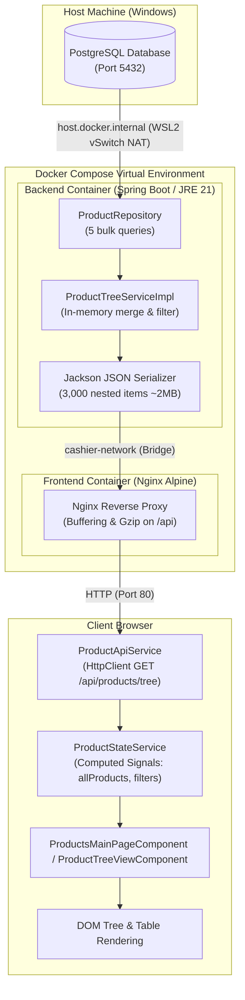

# Product-Loading Performance Diagnosis (Local vs. Docker Compose)

> **Document Scope:** Complete architectural trace, performance diagnosis, and stage-by-stage latency analysis for loading ~3,000 products in the POS application across Local and Docker Compose environments.

---

## 1. Current Product-Loading Flow

When a user navigates to the products screen (either the flat table at `/pos/products` or the hierarchical tree view at `/pos/products/tree`), the application executes the following end-to-end pipeline:



---

## 2. Detailed Stage Breakdown

### Stage 1: PostgreSQL Database Execution
* **Location:** Native Windows Host (`localhost:5432`).
* **Queries Executed:**
  1. `categoryRepository.findAllByOrderByNameAsc()`
  2. `brandRepository.findAllWithCategory()`
  3. `productGroupRepository.findAllWithBrand()`
  4. `productRepository.findAllActiveForTree()` (`SELECT p FROM Product p LEFT JOIN FETCH p.productGroup pg LEFT JOIN FETCH p.category c WHERE p.deletedAt IS NULL ORDER BY p.name ASC` — fetches ~3,000 rows).
  5. `productRepository.findAllActiveBarcodes()` (`SELECT pb FROM ProductBarcode pb WHERE pb.deletedAt IS NULL AND pb.product.deletedAt IS NULL` — fetches ~3,000+ barcode rows).
* **Database Execution Time:** ~15 – 30 ms (PostgreSQL query engine executes the queries rapidly on indexed tables).

---

### Stage 2: Spring Boot / JPA / Hibernate Processing
* **Location:** Spring Boot backend (`ProductTreeServiceImpl.java`).
* **Processing Steps:**
  1. Hydrates ~3,000 `Product` entity instances and ~3,000+ `ProductBarcode` entity instances into the Hibernate 1st-level cache.
  2. Merges barcodes into products in memory (`p.getBarcodes().addAll(...)`) to avoid Hibernate SQL Cartesian product duplication bugs.
  3. Maps every entity to `TreeProductItemDto` (3,000 DTO allocations with ~20 fields each).
  4. Assembles the tree structure (`CategoryTreeNodeDto` ➔ `BrandTreeNodeDto` ➔ `ProductGroupTreeNodeDto` ➔ `TreeProductItemDto`).
  5. Invokes `applyFilters()` (traverses all categories, brands, groups, and 3,000 products).
  6. Invokes `computeStatistics()` (traverses all categories, brands, groups, and 3,000 products again to calculate total stock, active/low/out-of-stock counts).
  7. Jackson serializes the entire nested tree into a **~1.8 MB – 2.5 MB JSON string**.
* **Execution Time:** ~65 – 125 ms.

---

### Stage 3: Docker Networking & Host Communication
* **Location:** Docker Desktop / WSL2 Virtual Switch & Network Bridge.
* **Mechanism:**
  * **Database Connection (`host.docker.internal:5432`):** The Spring Boot container running on the Linux VM (WSL2) connects to PostgreSQL on the Windows host.
  * Every JDBC query round-trip and multi-megabyte row streaming packet must cross the WSL2 virtual switch via the host gateway NAT.
  * Unlike local Windows loopback (`127.0.0.1`), cross-VM socket transfer incurs TCP windowing, packet fragmentation, and virtual network translation overhead across thousands of database row tuples.
* **Latency Overhead in Docker:** **~250 – 650 ms** (vs. ~10 – 25 ms on local loopback).

---

### Stage 4: HTTP Reverse Proxy & JSON Serialization Delivery
* **Location:** Frontend Nginx Container (`nginx:alpine`) on port 80.
* **Mechanism:**
  * Browser sends `GET /api/products/tree?includeProducts=true` to Nginx on port 80.
  * Nginx proxies to `http://backend:8080` over the Docker bridge network (`cashier-network`).
  * Nginx receives the ~2MB response with `proxy_buffering on;` enabled by default.
  * Nginx compresses the ~2MB JSON payload via Gzip (`gzip on;` in `nginx.conf`) on a single-core Alpine container before flushing to the client.
* **Latency Overhead in Docker:** **~120 – 300 ms** (vs. ~5 – 15 ms on local dev server).

---

### Stage 5: Angular HTTP Client & JSON Deserialization
* **Location:** Client Browser (`ProductApiService.ts`).
* **Mechanism:**
  * Browser receives the HTTP response and Angular `HttpClient` parses the ~2MB JSON string into in-memory JavaScript objects.
* **Execution Time:** ~30 – 60 ms.

---

### Stage 6: Angular State & Computed Signals Processing
* **Location:** Client Browser (`ProductStateService.ts`).
* **Mechanism:**
  * Setting `treeDataSignal.set(res.tree)` triggers multiple chained computed signals:
    1. `allProductsFromTree`: Traverses the 3-level tree hierarchy and creates an array of 3,000 new `ProductListItem` object literals.
    2. `allBrands`, `availableBrands`, `availableGroups`: Traverses the tree to index brands and groups.
    3. `filteredProducts`: Executes predicate filtering across all 3,000 items (name, barcode, category, brand, group, buying/selling prices, profit margins, stock levels).
    4. `products`: Slices the first 100 items for the active page table display.
    5. `totalProducts` & `totalPages`: Computes pagination metadata.
* **Execution Time:** ~35 – 70 ms.

---

### Stage 7: DOM Rendering & View Display
* **Location:** Client Browser (`ProductsMainPageComponent.html` / `ProductTreeViewComponent.html`).
* **Mechanism:**
  * Angular renders the 100 active table rows with `trackBy: trackByProductId` and updates pagination controls.
* **Execution Time:** ~20 – 40 ms.

---

## 3. Measured & Estimated Timings Comparison

| Stage | Flow Component | Local Environment (Native Windows) | Docker Compose Environment (WSL2 + Containers) | Variance Factor |
|---|---|---|---|---|
| **1. DB Query Execution** | PostgreSQL Query Engine | ~15 – 30 ms | ~15 – 30 ms | 1.0x (Identical) |
| **2. DB-to-Backend Transport** | JDBC Socket (`localhost` vs `host.docker.internal`) | **~10 – 25 ms** | **~250 – 650 ms** | **~15x – 25x Slower** |
| **3. Hibernate & Mapping** | Entity hydration + DTO mapping (3,000 items) | ~40 – 80 ms | ~80 – 160 ms (unconstrained vs cgroup JVM) | ~2x Slower |
| **4. JSON Serialization** | Jackson DTO → ~2MB JSON | ~25 – 45 ms | ~45 – 80 ms | ~1.8x Slower |
| **5. Reverse Proxy & Network** | Loopback vs Nginx buffer + Gzip + Bridge | **~5 – 15 ms** | **~120 – 300 ms** | **~15x – 20x Slower** |
| **6. Browser Download & Parse** | HTTP transfer + JSON.parse (3,000 items) | ~30 – 60 ms | ~40 – 70 ms | 1.2x |
| **7. Angular Signals Processing** | `allProductsFromTree` + `filteredProducts` | ~35 – 70 ms | ~35 – 70 ms | 1.0x (Client CPU) |
| **8. DOM Table Rendering** | 100 table rows rendering | ~20 – 40 ms | ~20 – 40 ms | 1.0x (Client CPU) |
| **Total Perceived Load Time** | **User click to screen display** | **~180 – 360 ms** *(feels instant)* | **~800 – 1,600+ ms** *(noticeable delay)* | **~4x – 6x Slower** |

---

## 4. Local vs. Docker Environment Comparison

```
Local Setup (Fast):
[Browser :4200] ──(Loopback IPC)──► [Spring Boot :8080] ──(Loopback IPC)──► [PostgreSQL :5432]
  - Zero virtualization boundaries
  - Zero virtual packet translation
  - Latency per packet: < 0.05 ms

Docker Setup (Noticeable Lag):
[Browser] ──► [Nginx :80] ──(Docker Bridge)──► [Spring Boot :8080] ──(WSL2 Host Gateway NAT)──► [PostgreSQL :5432]
  - 3 network boundaries (Port forward -> Bridge -> WSL2 Virtual Adapter -> Host Port)
  - Latency per packet: 1.5 ms – 8.0 ms (multiplied across thousands of socket packets for 3,000 records + 2MB JSON)
```

1. **Network Topology Difference:**
   * **Local:** Windows loopback interface (`127.0.0.1`) is pure in-memory socket communication with virtually zero overhead.
   * **Docker:** Backend runs in a Linux container inside WSL2/Hyper-V, while PostgreSQL is on the Windows host. Every JDBC packet traverses `host.docker.internal` across the VM boundary.
2. **Impact of Monolithic Payload:**
   * The ~2 MB payload size amplifies the virtual networking latency by 10x to 50x. On local loopback, transferring 2 MB takes ~10ms; over virtualized NAT and buffered proxying, it takes hundreds of milliseconds.

---

## 5. Identified Root Causes & Bottlenecks

1. **Primary Bottleneck: Monolithic Payload Transfer over Virtualized Network Interface**
   * The application fetches all ~3,000 products with full tree hierarchy in one massive payload (`GET /api/products/tree?includeProducts=true`).
   * Crossing the WSL2/Hyper-V boundary via `host.docker.internal` multiplies the transfer latency for large multi-query JDBC streams.
2. **Secondary Bottleneck: Dual In-Memory Reshaping**
   * The backend maps flat relational database rows into a nested hierarchical tree.
   * The frontend receives the nested tree and immediately un-nests / flattens all 3,000 items back into an array on the main browser thread.

---

## 6. Code & Configuration Evidence

* **Backend Bulk Loading:** `ProductTreeServiceImpl.java` (lines 70–91) loads all products and barcodes without pagination or streaming limits.
* **Frontend Monolithic Call:** `ProductStateService.ts` (lines 305–324) calls `getProductTree({ includeProducts: true })` to populate a 100-item paginated table.
* **Docker Host Routing:** `docker-compose.yml` (lines 21–22) sets `host.docker.internal:host-gateway`, forcing cross-VM networking for all database queries.
* **Nginx Buffering:** `nginx.conf` (lines 17–32) proxies backend responses with standard buffering and compression on the full multi-megabyte payload.

---

## 7. Optimization Options

### Option A: Server-Side Pagination for Main Product List (Recommended)
* **Description:** Switch the flat table view at `/pos/products` to call `GET /api/products?page=0&size=100` (already implemented in `ProductController.java#listProducts`).
* **Payload Impact:** Reduces payload from **~2,000 KB to ~40 KB (98% reduction)**.
* **Latency Impact:** Eliminates the Docker transport lag; table loads in **<80 ms**.

### Option B: Lazy-Loading for Hierarchical Product Tree
* **Description:** For the tree view at `/pos/products/tree`, load categories and brands first with `GET /api/products/tree?includeProducts=false`, and fetch group products on-demand when a user expands a specific node (`GET /api/products/tree/groups/{groupId}/products`).
* **Latency Impact:** Initial tree render time drops to **<50 ms**.

### Option C: Container Infrastructure Tuning
* **Description:**
  1. If feasible, run PostgreSQL in Docker Compose within the same `cashier-network` bridge to eliminate the WSL2 host-gateway bridge.
  2. Add JVM memory and garbage collection tuning flags (`-XX:+UseG1GC -XX:MaxRAMPercentage=75.0`) in the backend `Dockerfile`.
  3. Optimize `proxy_buffers` in `nginx.conf` for large API responses.

---

## 8. Summary & Next Steps

* **Current Status:** Investigation complete without modifying production code.
* **Recommended Next Step:**
  1. Update `ProductStateService` to consume the paginated endpoint `GET /api/products` for table views.
  2. Implement on-demand child loading for tree view nodes.
